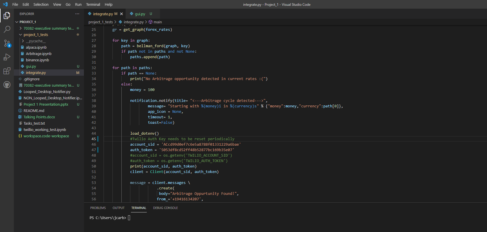

# Overview of Project and conclusions
1. Problem Statement
    - One of the major issues with the financial industry is the power large banks and broker dealer have in the currency markets. The major reason for this is due to the fact that for all intent and purpose they are the only ones with the ability to see and timily capture arbitrage opportunities. 
2.  Proposed solution
    - In order to alleviate this the team have come up with an app that detects any arbitrage opportunity. We used open source python programming as well as several integration packages to bring the user a seemless way to visualize arbitrage opportunities

## Packages
#General packages needed
- json,
- urllib.request, 
- sys, 
- math, 
- re
- numpy 

#Packages needed for twilio notification
- os
- twilio.rest
- dotenv 

#Packages needed for desktop notification
- plyer
 
#Packages needed for GUI
- tkinter
- pillow as PIL

## Instructions

The main function currently has all the functions and paths needed to fully executive the code. Assuming all the packages are properly installed the below code will be fully executable. The code can be found in the **integrate.py**  

def main():
    forex_rates = get_rates()
    print("Current Forex Rates:")
    print(forex_rates)
    print("\n")
    gr = get_graph(forex_rates) #gets the current forex rates
    
    for key in graph: 
        path = bellman_ford(graph, key)
        if path not in paths and not None:
            paths.append(path)

    for path in paths:
        if path == None:
            print("No Arbitrage opportunity detected in current rates :(")
        else:
            money = 100 #base amount of currency we are starting with
            
            notification.notify(title= "<---Arbitrage cycle detected--->",
                    message= "Starting with %(money)i in %(currency)s" % {"money":money,"currency":path[0]},
                    app_icon = None,
                    timeout= 30,
                    toast=False)

            load_dotenv() 

            account_sid = os.getenv('TWILIO_ACCOUNT_SID')
            auth_token = os.getenv('TWILIO_AUTH_TOKEN')
            #print(account_sid, auth_token)
            client = Client(account_sid, auth_token)

            #This tells the user if there is any arb opportunites available
            print("<---Arbitrage cycle detected--->")
            print("Starting with %(money)i in %(currency)s" % {"money":money,"currency":path[0]})

            #Displays the paths available and prints out the oppositite path as well
            for i,value in enumerate(path):
                if i+1 < len(path):
                    start = path[i]
                    end = path[i+1]
                    rate = math.exp(-graph[start][end])
                    money *= rate
                    print("%(start)s to %(end)s at a rate of %(rate)f = %(money)f" % {"start":start,"end":end,"rate":rate,"money":money})

            #Message to be send via text
            message = client.messages \
                    .create(
                    body="%(start)s to %(end)s at a rate of %(rate)f = %(money)f" % {"start":start,"end":end,"rate":rate,"money":money},
                    from_='+19416134207',
                    to='+15165547061'
                       )    
        print("\n")

 

## Background

- The bellman ford algo is an algo that can help us quickly find "the shortest path". In the case of currencies, the shortest path would be the set of currencies pairs that would have the largest potential arb opportunity

## Data research 
- We found historical data in CSV form but this was not timely and each set of currencies were edited slightly.
- We explored several APIs, including bianance, alpaca and other FX specific API services. We found a lot of issues with many of time, including timely information and formatting issues. We settled on forex economics as the API delivered the fx exchange for a combination of crypto as well as fiat currencies and it was all delivered in a JSON file which we could handle.

## Code build out
- Explain our initial ~modular concept
- Show images of the results from the soltions

## Visualizations

## Next steps
- Further build out the user interface
- Expand functionality of application (e.g more currencies)
- Connect to broker dealer to allow users to actually profit of code if they so choose

## Credits

The code was a collaboration between **Babajide Ademola** **Joel Carballo** and **Nathan Nelson**. All three are part of the colombia university finanical engineering boothcamp program.
